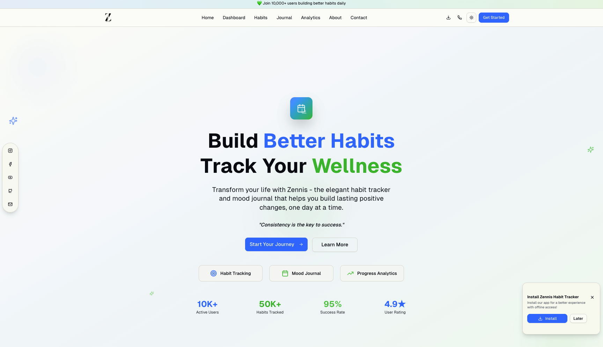

# Zennis Habit Tracker

A modern, elegant habit tracker and mood journal built with Next.js 15, designed to help users build better habits and track their wellness journey.

.png)

## 🌟 Features

- **Habit Tracking**: Create, manage, and track daily habits with streak counters
- **Mood Journaling**: Record daily moods and reflections
- **Analytics Dashboard**: Visualize progress with charts and insights
- **Dark/Light Mode**: Seamless theme switching with system preference support
- **PWA Support**: Install as a mobile app with offline capabilities
- **Responsive Design**: Optimized for all devices and screen sizes
- **Smooth Animations**: Engaging user experience with custom animations

## 🚀 Tech Stack

- **Framework**: Next.js 15 (App Router)
- **Styling**: Tailwind CSS v4 with custom design system
- **UI Components**: shadcn/ui with Radix UI primitives
- **Typography**: Geist Sans & Geist Mono fonts
- **Theme**: next-themes for dark/light mode
- **Icons**: Lucide React
- **Analytics**: Vercel Analytics
- **Deployment**: Vercel Platform

## 📁 Project Structure

\`\`\`
zennis-habit-tracker/
├── app/                          # Next.js App Router
│   ├── about/                    # About page
│   │   └── page.tsx
│   ├── analytics/                # Analytics dashboard
│   │   └── page.tsx
│   ├── auth/                     # Authentication
│   │   └── page.tsx
│   ├── contact/                  # Contact page
│   │   └── page.tsx
│   ├── dashboard/                # Main dashboard
│   │   └── page.tsx
│   ├── habits/                   # Habit management
│   │   ├── add/
│   │   │   └── page.tsx
│   │   └── page.tsx
│   ├── journal/                  # Mood journaling
│   │   ├── add/
│   │   │   └── page.tsx
│   │   └── page.tsx
│   ├── sitemap/                  # Site navigation
│   │   └── page.tsx
│   ├── globals.css               # Global styles & theme
│   ├── layout.tsx                # Root layout
│   └── page.tsx                  # Home page
├── components/                   # React components
│   ├── ui/                       # shadcn/ui components
│   │   ├── accordion.tsx
│   │   ├── alert.tsx
│   │   ├── avatar.tsx
│   │   ├── badge.tsx
│   │   ├── button.tsx
│   │   ├── card.tsx
│   │   ├── dropdown-menu.tsx
│   │   ├── input.tsx
│   │   ├── label.tsx
│   │   ├── select.tsx
│   │   ├── textarea.tsx
│   │   ├── toast.tsx
│   │   └── toaster.tsx
│   ├── auth-provider.tsx         # Authentication context
│   ├── bottom-navigation.tsx     # Mobile bottom nav
│   ├── desktop-shortcut.tsx      # PWA install prompt
│   ├── features-section.tsx      # Landing page features
│   ├── floating-social-bar.tsx   # Social media links
│   ├── footer.tsx                # Site footer
│   ├── hero-section.tsx          # Landing page hero
│   ├── install-prompt.tsx        # PWA install banner
│   ├── motivation-section.tsx    # Motivational content
│   ├── navigation.tsx            # Main navigation
│   ├── theme-provider.tsx        # Theme context
│   └── theme-toggle.tsx          # Dark/light mode toggle
├── hooks/                        # Custom React hooks
│   ├── use-mobile.tsx            # Mobile detection
│   └── use-toast.ts              # Toast notifications
├── lib/                          # Utility functions
│   ├── pwa.ts                    # PWA service worker
│   └── utils.ts                  # General utilities
├── public/                       # Static assets
│   ├── images/                   # Image assets
│   │   ├── zennis-logo-dark.png  # Dark theme logo
│   │   ├── zennis-logo-light.png # Light theme logo
│   │   ├── workout-1.jpeg        # Motivational images
│   │   ├── workout-2.jpeg
│   │   ├── workout-3.jpeg
│   │   └── workout-4.jpeg
│   ├── favicon.ico               # Site favicon
│   ├── icon-192x192.jpg          # PWA icon
│   ├── manifest.json             # PWA manifest
│   └── sw.js                     # Service worker
├── next.config.mjs               # Next.js configuration
├── package.json                  # Dependencies
├── tailwind.config.js            # Tailwind configuration
├── tsconfig.json                 # TypeScript configuration
└── README.md                     # This file
\`\`\`

## 🎨 Design System

### Colors
- **Primary**: Purple (#8B5CF6) - Main brand color
- **Secondary**: Green (#10B981) - Accent color
- **Background**: Dynamic light/dark backgrounds
- **Foreground**: High contrast text colors

### Typography
- **Headings**: Geist Sans (multiple weights)
- **Body**: Geist Sans (400, 500)
- **Code**: Geist Mono

### Components
- Built with shadcn/ui for consistency
- Custom animations and transitions
- Responsive design patterns
- Accessibility-first approach

## 🛠️ Installation & Setup

1. **Clone the repository**
   \`\`\`bash
   git clone https://github.com/your-username/zennis-habit-tracker.git
   cd zennis-habit-tracker
   \`\`\`

2. **Install dependencies**
   \`\`\`bash
   npm install
   # or
   yarn install
   # or
   pnpm install
   \`\`\`

3. **Run the development server**
   \`\`\`bash
   npm run dev
   # or
   yarn dev
   # or
   pnpm dev
   \`\`\`

4. **Open your browser**
   Navigate to [http://localhost:3000](http://localhost:3000)

## 📱 PWA Features

- **Offline Support**: Service worker for offline functionality
- **Install Prompt**: Native app-like installation
- **Mobile Optimized**: Responsive design for all devices
- **App Icons**: Custom icons for different platforms

## 🌙 Theme System

The app supports three theme modes:
- **Light Mode**: Clean, bright interface
- **Dark Mode**: Easy on the eyes for low-light usage
- **System**: Automatically matches your device preference

Theme switching is handled by `next-themes` with proper SSR support and no flash of incorrect theme.

## 🚀 Deployment

### Vercel (Recommended)
1. Push your code to GitHub
2. Connect your repository to Vercel
3. Deploy with zero configuration

### Other Platforms
The app can be deployed to any platform that supports Next.js:
- Netlify
- Railway
- DigitalOcean App Platform
- AWS Amplify

## 🤝 Contributing

1. Fork the repository
2. Create a feature branch (`git checkout -b feature/amazing-feature`)
3. Commit your changes (`git commit -m 'Add amazing feature'`)
4. Push to the branch (`git push origin feature/amazing-feature`)
5. Open a Pull Request

## 📄 License

This project is licensed under the MIT License - see the [LICENSE](LICENSE) file for details.

## 💖 Support

If you find this project helpful, consider:
- ⭐ Starring the repository
- 🐛 Reporting bugs
- 💡 Suggesting new features
- 💰 Supporting via [Binance Donation](https://your-binance-link)

## 📞 Contact

- **Email**: mehedipathantext@gmail.com
- **Phone**: +1 (555) 123-4567
- **Location**: San Francisco, CA
- **Crisis Support**: Call 988 for mental health support

---

Built with ❤️ by the Zennis Team
